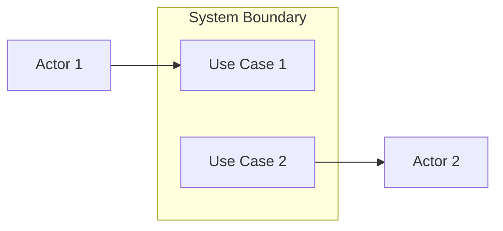

# UML Use Case Diagram (Mermaid)

## Workflow

### Step 1: Tanya user file mana yang dikonversi

1. List semua file `.md` di `uml/mermaid/` (skip `out/` folder)
2. Tampilkan ke user sebagai pilihan
3. User pilih file mana yang akan dirender

### Step 2: Render via MCP mermaid

1. Baca file `.md` yang dipilih → ekstrak blok ` ```mermaid ... ``` `
2. Render via MCP tool `mcp-mermaid` → generate PNG
3. Pastikan folder `uml/mermaid/out/` ada
4. Simpan hasil PNG ke `uml/mermaid/out/<nama>.png`

### Step 3: Konfirmasi

Laporkan hasil: file yang dirender, ukuran, status.

---

## Konsep UML (WAJIB)

- **Actor** = entitas **di luar** sistem yang berinteraksi dengan sistem (Admin, User, Payment Gateway, dll)
- **System Boundary** = batas ruang lingkup sistem — **bukan aktor**
- **Use Case** = fungsi/layanan di dalam sistem
- **"Sistem" BUKAN aktor** — sistem tidak berinteraksi dengan dirinya sendiri
- Proses internal (scheduler, worker, background job) = **bagian dari sistem**, bukan aktor

## Template



## Aturan

1. **Diagram type**: `flowchart LR` (left-right)
2. **Boundary**: `subgraph` dengan `direction TB` (Top-Bottom / vertikal)
3. **Aktor 1**: deklarasi sebelum boundary → posisi kiri
4. **Aktor 2**: deklarasi setelah boundary → posisi kanan
5. **Jika hanya 1 aktor**: deklarasi di kiri, kanan kosong
6. **Use case internal**: tetap di boundary, tanpa panah dari aktor
7. **Multi-kolom**: jika >6 use case, pakai nested `subgraph` (max 4 per kolom)

## Template Layout Rules

```
Actor 1 (kiri)  |  System Boundary (tengah, vertikal)  |  Actor 2 (kanan)
```

## Output

```
uml/
  mermaid/
    <nama-use-case>.md     ← Mermaid syntax
    out/
      <nama-use-case>.png  ← hasil render MCP mermaid
```

## Common Mistakes

| Kesalahan | Perbaikan |
|-----------|-----------|
| "Sistem" dijadikan aktor | Sistem = boundary, bukan aktor |
| Scheduler/worker jadi aktor | Proses internal = bagian sistem |
| Boundary melebar horizontal | `flowchart LR` + multi-kolom nested subgraph |
| Use case internal dihubungkan ke aktor | Biarkan tanpa panah dari aktor |